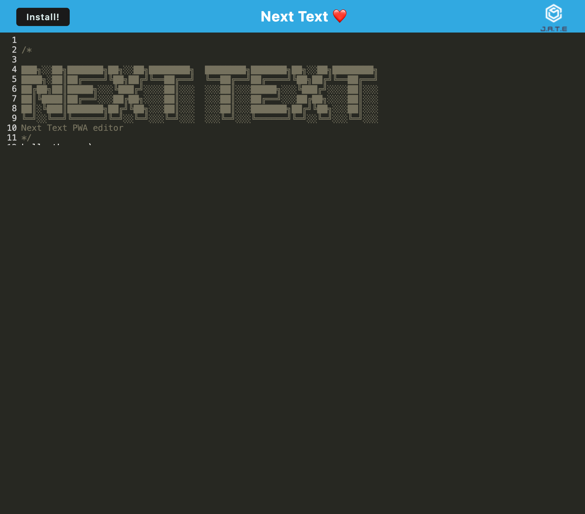

# Next Text PWA

A Progressive Web App (PWA) text editor for seamless text creation, saving, and installation.

## Table of Contents

- [Features](#features)
- [Getting Started](#getting-started)
- [Installation](#installation)
- [Usage](#usage)
- [Configuration](#configuration)
- [Contributing](#contributing)
- [License](#license)
- [Questions](#questions)

## Features

- **Text Editing:** A simple and intuitive text editor for creating and modifying content.
- **Save and Install:** Users can save their text and install the app for convenient access.
- **Offline Access:** Utilizes Service Workers for caching, enabling offline access to saved content.
- **Responsive Design:** Built to provide a seamless experience across devices.

## Getting Started

[Node.js](https://nodejs.org/) installed on your machine

- [npm](https://www.npmjs.com/) package manager

### Installation

- Clone the repository:

git clone https://github.com/Ninamahdawe/NexText-PWA.git

- Change into the project directory:

cd next-text-pwa

- Install dependencies:

npm install

## Usage

- Start the development server:

npm run dev

- Open your browser and visit http://localhost:3000.

### Configuration

Contributions are welcome! Please follow the contribution guidelines when submitting pull requests.

## License

[License Details](https://opensource.org/licenses/MIT)

## Questions

for any questions please feel free to reachout to me via email at Ninamahdawe11@gmail.com or contact me via github.com

https://github.com/Ninamahdawe

Screenshot ]
